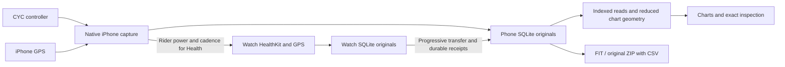

# Architecture

Power Log uses Expo/React Native on iPhone, React Native Web in the browser, and SwiftUI on Apple Watch. Native Swift owns Bluetooth, sensors and durable recording independently of React. Web recording requires an active page and uses IndexedDB. Android uses the web app in a compatible browser; there is no native Android app.

Browser Bluetooth setup is cancellable and gives each connection/discovery/notification step 15 seconds; controller requests have a 2.5-second response deadline. Cancelled or expired attempts cannot publish samples or change a newer connection.

After a transport interruption, web reconnects to the already selected bike, rediscovers its characteristics and validates identity before resuming telemetry. It matches native retry timing: immediate after a peer disconnect with 30 seconds of stable telemetry, otherwise 1/2/4/8/16 seconds, then every 30 seconds while a ride remains active. Thirty seconds of fresh telemetry resets the retry budget; identity alone does not end recovery. Explicit Disconnect cancels retries. Automatic recovery preserves the sample timeline, marks a new transport epoch and records only actual responses. The shared six-second display hold masks brief gaps without changing stored data. See Chrome's [automatic reconnect example](https://googlechrome.github.io/samples/web-bluetooth/automatic-reconnect.html).

## Code map

| Location | Responsibility |
| --- | --- |
| `src/app/` | Routes and providers |
| `src/features/`, `src/components/` | Screens, shared controls and charts |
| `src/core/` | Protocol, validation, measurements and typed contracts |
| `src/services/` | Platform adapters, scheduling and presentation state |
| `modules/cyc-bridge/ios/` | Bluetooth, SQLite, workouts, transfer, native charts and exports |
| `apple/WatchApp/`, `apple/LiveActivity/` | Watch companion and WidgetKit extension |
| `app.config.ts`, `plugins/` | Permissions, background modes and reproducible native targets |
| `tests/`, native `Tests/` | Regression tests and synthetic benchmarks |

Metro selects `.native.ts`/`.native.tsx` and `.web.ts` implementations. Base modules supply shared/type-check fallbacks; absence of direct callers does not make them dead code. Expo autolinking and native delegates are runtime entry points too. Generated `ios/` and `android/` projects are not maintained source; standalone test runners must stay out of app source phases.

## Recording and presentation

`CycBridgeAppDelegateSubscriber` starts native recovery without React. `CycEngine` serializes discovery, identity verification, polling and reconnection with one outstanding request. Its two permitted controller commands are defined in [protocol](protocol.md).

`WorkoutEngine` routes commands to one owner: Watch when selected, iPhone otherwise. Capture, local retention, Health saving and final archive verification are separate states; see [storage and lifecycle](storage.md). History pages metadata without loading whole rides or changing the active owner. Reading charts never starts capture or writes to Health.

Recording continues without UI listeners. Hidden screens stop analytical reads and display timers; returning refreshes current state instead of replaying every sample. Sample-driven connection presentation is bounded at 4 Hz and ordinary workout presentation at 1 Hz; lifecycle changes are immediate. An updating clock is not evidence of fresh telemetry.

Live Activities publish native snapshots and route App Intents through the owner using ride identity and a phase-bound control token. Confirmed owner completion, applied Stop acknowledgement or a verified terminal archive ends the Activity even if other receipts remain pending. Dismissing it does not stop capture. Background Watch starts cannot assume an Activity can be created. See Apple's [Activity lifecycle](https://developer.apple.com/documentation/activitykit/activity) and [immediate dismissal](https://developer.apple.com/documentation/activitykit/activityuidismissalpolicy/immediate).

## Chart queries and rendering

[MonitorSource](../src/core/monitor.ts) separates description, latest values, reduced `plot` geometry, exact `inspectAt`, `rangeStats` and revision changes. Queries carry source identity, revision, distance selection and generation; stale results cannot replace a different source. Each read lane coalesces pending requests. Cancellation does not free an executing native slot until that work finishes.

Acquisition rate (2/4/8 Hz) is independent of drawing resolution. Plots retain original first/minimum/maximum/last observations per bucket, choosing detail from the visible range and measured plot width. Native SQLite and browser IndexedDB use multiresolution summaries, descending to originals at clipped boundaries or for close inspection. Caches are bounded, disposable and revision-bound. Exact cursor, peak, minimum and A–B values remain independent of reduced geometry. CSV analysis uses a separate size-limited in-memory source.

On iPhone, [MonitorRasterView](../modules/cyc-bridge/ios/MonitorRasterView.swift) presents bitmaps prepared off the main thread. Cursor and pan/pinch feedback transforms the accepted scene on the UI thread; it does not rebuild every path per touch. Bitmap, viewport and hit table are installed together. Dragging follows horizontal time regardless of finger height; a tap can select an original extreme. Exact lookups preserve observation identity/time, clear missing values and reject responses from an earlier selection. Web uses SVG and the shared viewport model.

Existing plots remain visible during refresh. “Awaiting data” means a live source has no measurements, not merely that distance or finalization is pending. The six-second presentation grace period never creates recorded or exported samples; [measurements](measurements.md) defines source semantics and missing-data behavior.

## UI contracts

- Ride, Battery and Temperature presets independently retain numbers, chart order, range and desktop column preference. Different scales stay separate even when units match; compatible physical speed sources may share an axis.
- One finger inspects; two fingers pan/pinch. Navigation pauses following, not recording; Live resumes it. Full screen preserves the selection/window. Handles support drag and accessible ordering.
- Settings owns recording defaults, distance source and speed units. Recording choices freeze at Start; analysis preferences also affect historical reads/exports. Chart configuration stays beside charts.
- iPhone and web share metric colors, dark chart cards, borders and labels. Container size/text scale determine columns, not changing values. Legends reserve stable label, value/unit and timestamp rows; empty text centers within the plotted grid using layout alignment.
- Desktop offers bounded multi-column charts and a readings sidebar; narrow windows stack controls. Shrinking the window does not overwrite saved layout preferences. Native bottom navigation and the web header stay outside content transitions.
- Modals use one stationary backdrop and shared transition. Safe-area bounds, scrollable content and stable status space prevent options, keyboards or refreshes from moving the surrounding page.

The iPhone shares FIT through the system share sheet; Strava upload is manual in the browser. There is no account backend. [Testing](testing.md) distinguishes source checks from builds and physical recording/gesture acceptance.
